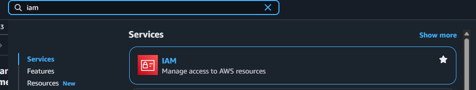
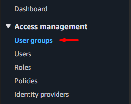
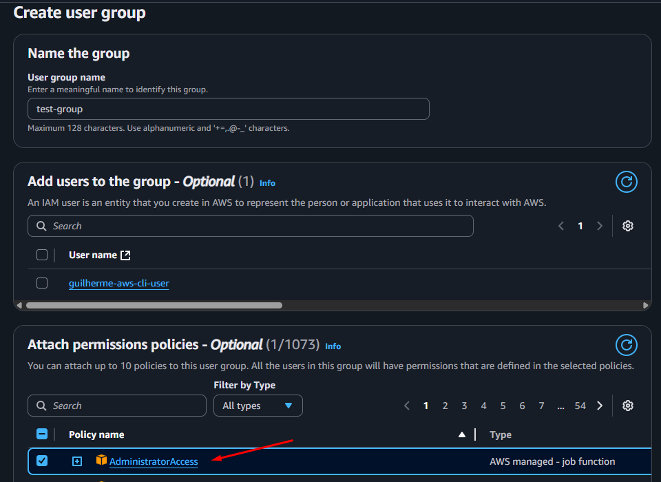
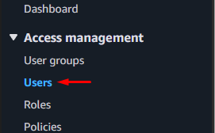
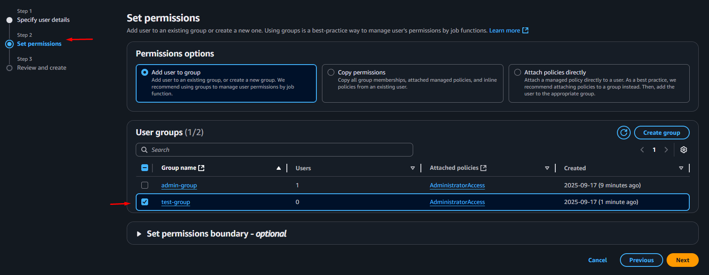
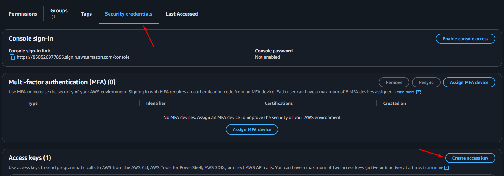
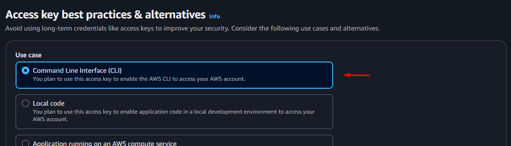
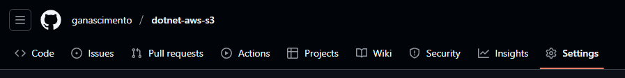
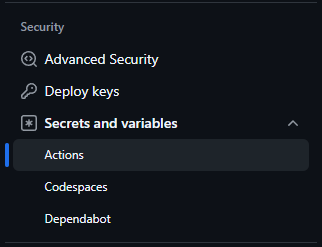
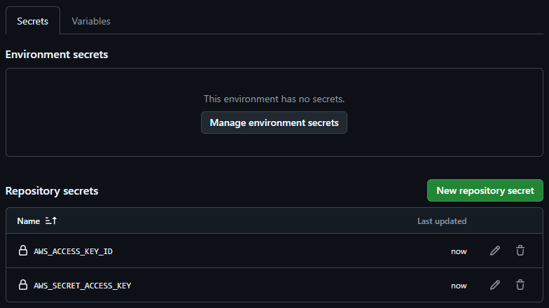

# 💾 Dotnet AWS S3

This project was created to learn how to use S3 in dotnet and deploy this application, building the structure in aws with terraform and deploying with GitHub Actions

## ✨ Features

- **AWS S3 Integration**: Upload, download, list, and delete files directly from an S3 bucket using a .NET 9 API.
- **Terraform Infrastructure as Code**: Provision S3 buckets and EC2 instances automatically with reusable Terraform modules.
- **Automated CI/CD with GitHub Actions**: Deploy infrastructure and application to AWS on every push to main.
- **EC2 IAM Role Security**: Use IAM roles for secure, keyless access to AWS resources from your API.
- **Presigned URL Generation**: Generate temporary public links for S3 files with custom expiration.
- **Swagger/Scalar UI**: Interactive API documentation and file upload interface out-of-the-box.
- **Environment Separation**: Use appsettings for local development and secure production best practices.

## 📚 Resources

- [.NET 9](https://dotnet.microsoft.com/pt-br/)
- [AWS](https://aws.amazon.com)
- [Terraform](https://developer.hashicorp.com/terraform)
- [GitHub Actions](https://github.com/features/actions)

<br>


<br>

## 🚀 Installation

### Clone the repository:

```bash
git clone https://github.com/ganascimento/dotnet-keycloak.git
cd dotnet-keycloak
```

### Install resouces

- Install [terraform cli](https://developer.hashicorp.com/terraform/tutorials/aws-get-started/install-cli) on your machine.
- Install [AWS cli](https://docs.aws.amazon.com/cli/latest/userguide/getting-started-install.html) on your machine.

### Configure AWS

- Go to aws and go to IAM DashBoard
<div style="margin-left: 40px">
    <p>
        
        <br>
    </p>
</div>

- Create group
<div style="margin-left: 40px">
    <p>
        
        <br>
    </p>
</div>

- Add the permission
<div style="margin-left: 40px">
    <p>
        
        <br>
    </p>
</div>

- Create user
<div style="margin-left: 40px">
    <p>
        
        <br>
    </p>
</div>

- Add user to group
<div style="margin-left: 40px">
    <p>
        
        <br>
    </p>
</div>

- Open the user and go to the `Security Credentials` tab and click on `Create access key`
<div style="margin-left: 40px">
    <p>
        
        <br>
    </p>
</div>

- Allow permission for CLI and create
<div style="margin-left: 40px">
    <p>
        
        <br>
    </p>
</div>

- Run command `aws configure` and add your `Access Key ID`, `Secret Access Key` and `region`
- To confirm that your access has been configured correctly, run: `aws sts get-caller-identity`, if it shows success like this:

```json
{
  "UserId": "AIDAEXAMPLEID",
  "Account": "123456789012",
  "Arn": "arn:aws:iam::123456789012:user/seu-usuario"
}
```

## 🧪 Test/Run Project

### Terraform

Go to folder `./terraform` and run:

```C#
// This will download the AWS provider and prepare the project

terraform init
```

```C#
// Terraform will show the resources it will create in AWS, without applying them yet

terraform plan
```

```C#
// He will show the plan again and ask for confirmation
// Type 'yes' to create the resources

terraform apply
```

#### ⚠️ Check in AWS if the resources were created, don't forget to check if the region is correct

If you want to remove the resources, run:

```C#
// He will ask and you confirm with 'yes'
terraform destroy
```

### Application

For local testing, add the `AccessKey` and `SecretKey` keys to your appsettings.json within the AWS object and set the value to `appsettings.Exemple.json`.

And execute application, to test access **`http://localhost:5107/scalar`**

## ⛭ GitHub Actions

Create your repository and go to settings

<div style="margin-left: 40px">
    <p>
        
        <br>
    </p>
</div>

Go to Security > Secret and variables > Actions

<div style="margin-left: 40px">
    <p>
        
        <br>
    </p>
</div>

Create your secrets

<div style="margin-left: 40px">
    <p>
        
        <br>
    </p>
</div>
